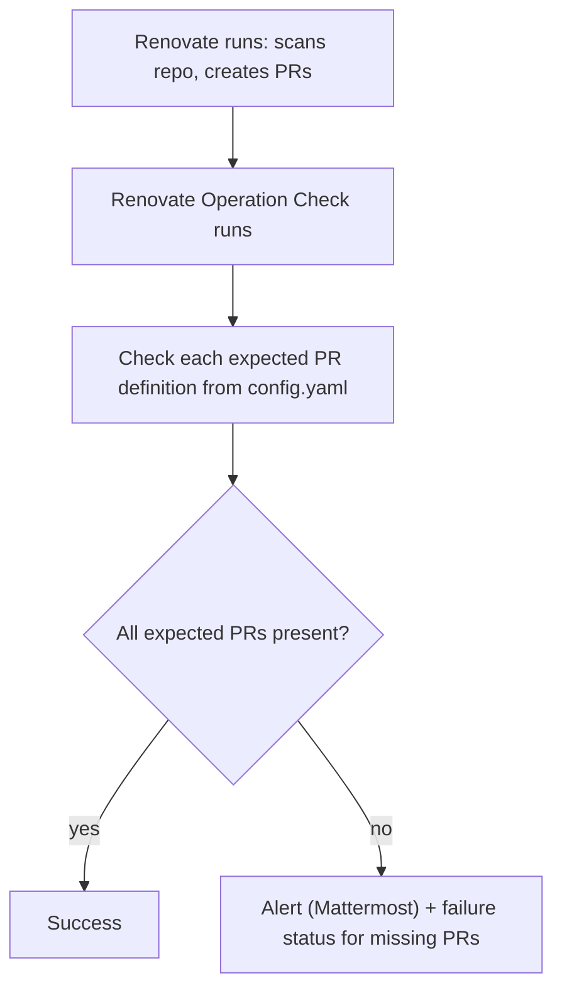

# Renovate Operation Check
The repo under test contains package managers (see docs/sample-monitoring-content).
The repo under test is scanned by Renovate and PRs are created. This Renovate Operation Check is checking for PRs and alerts you if the expected PRs (see `scripts/config/config.yaml`) doesn't exists.

## How it works

Renovate runs on its own schedule and creates the dependency PRs. This
Operation Check runs afterwards, verifies that the PRs expected in
`scripts/config/config.yaml` actually exist, and **alerts** (Mattermost
notification + failure status) when one is missing. It never creates PRs
itself — a missing PR means Renovate did not do its job.



## Run modes and switches

Two switches decide what a run actually does, and the CLI flag is the
authoritative one:

- `--enable-pr-check true` runs the `pr_checks` definitions. Without it the
  checks are skipped.
- `--enable-pr-cleanup true` runs the full cleanup (decline renovate PRs,
  delete branches, optionally decline all non-excluded branches). Without it
  the run only deletes already-declined PRs.

## Running the container image

The image is published as `wurstbrot/renovate-operation-check`. Its entrypoint
is

```
python -m scripts.main --config /app/config/config.yaml
```

and sets **neither** switch, so a plain `docker run <image>` only deletes
already-declined PRs. You must mount your own `config.yaml` at
`/app/config/config.yaml`; append the flags below to enable the other modes.

### CLI flags

| Flag | Values | Effect |
| --- | --- | --- |
| `--enable-pr-check` | `true` / `false` | Run the `pr_checks` definitions from `config.yaml`. Omitted → checks are skipped. |
| `--enable-pr-cleanup` | `true` / `false` | Run the full cleanup (decline renovate PRs, delete branches, optionally decline all non-excluded branches). Omitted → only already-declined PRs are deleted. |
| `--config` | path | Path to `config.yaml` (default `/app/config/config.yaml`). |
| `--log-level` | `DEBUG`…`CRITICAL` | Set the log level (overrides `--verbose` and `config.yaml`). |
| `--verbose` | flag | Shortcut for `--log-level DEBUG`. |
| `--log-file` | path | Write logs to a file (overrides `config.yaml`). |

### Environment variables

The bundled `config.yaml` reads its secrets and host names from environment
variables via `${VAR}` substitution. Provide at least the required ones:

| Variable | Required | Purpose |
| --- | --- | --- |
| `RENOVATE_TOKEN` | yes | Bitbucket token (`client.token`). |
| `BITBUCKET_BASE_URL` | yes | Bitbucket base URL (`client.base_url`). |
| `PROJECT_KEY` | yes | Bitbucket project key (`client.project_key`). |
| `RENOVATE_USERNAME` | no | Bitbucket username (`client.username`). |
| `MATTERMOST_WEBHOOK_URL` | when webhook enabled | Mattermost webhook URL. |
| `WEBHOOK_KEY` | no | Mattermost webhook key. |
| `MATTERMOST_TOKEN` | no | Mattermost API token. |
| `JOB_URL` | no | When set, notifications link to the pipeline/job log. |

Use `${VAR:default}` for a default value; the shell form `${VAR:-default}` is
**not** supported.

### Example: run the PR checks

```bash
docker run --rm \
  -e BITBUCKET_BASE_URL="https://bitbucket.example.com" \
  -e PROJECT_KEY="MYPROJ" \
  -e RENOVATE_TOKEN="$RENOVATE_TOKEN" \
  -e RENOVATE_USERNAME="renovate" \
  -v "$(pwd)/config.yaml:/app/config/config.yaml:ro" \
  wurstbrot/renovate-operation-check \
  --enable-pr-check true
```

Omit the flag to only delete already-declined PRs, or add
`--enable-pr-cleanup true` to run the full cleanup.

### Kubernetes

The entrypoint sets no switches, so pass them via `args`:

```yaml
args:
  - --enable-pr-check
  - "true"
  - --enable-pr-cleanup
  - "true"
```

## New PR Checks

Adjust your config.yaml:

```yaml
pr_checks:
  - name: new_check
    titleRegex: "pattern"
    contentRegex: "pattern"
```
e.g.:
```yaml
pr_checks:
  - name: NPM Major
    titleRegex: 'Update npm \(major\)$'
```
